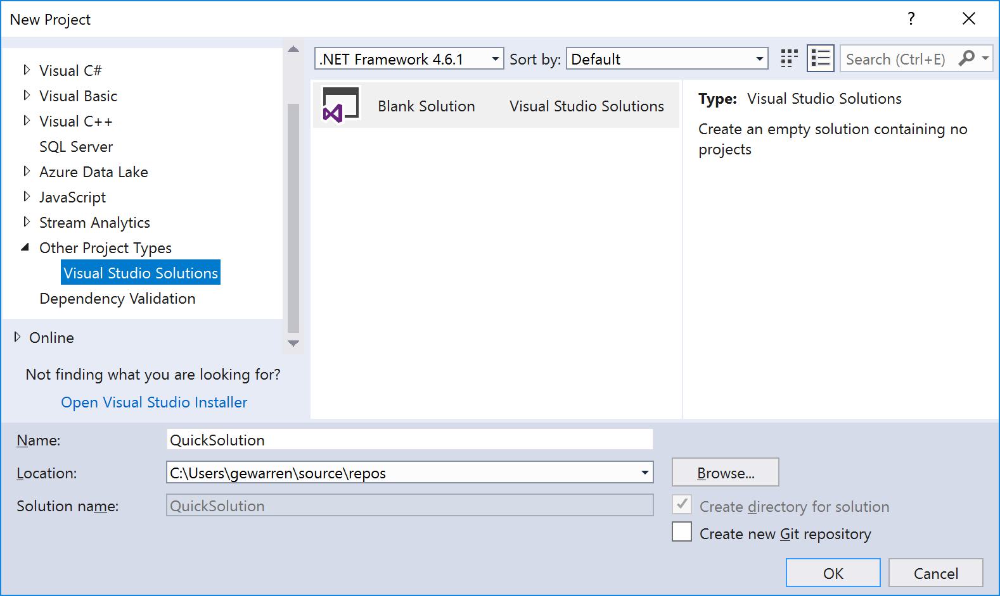
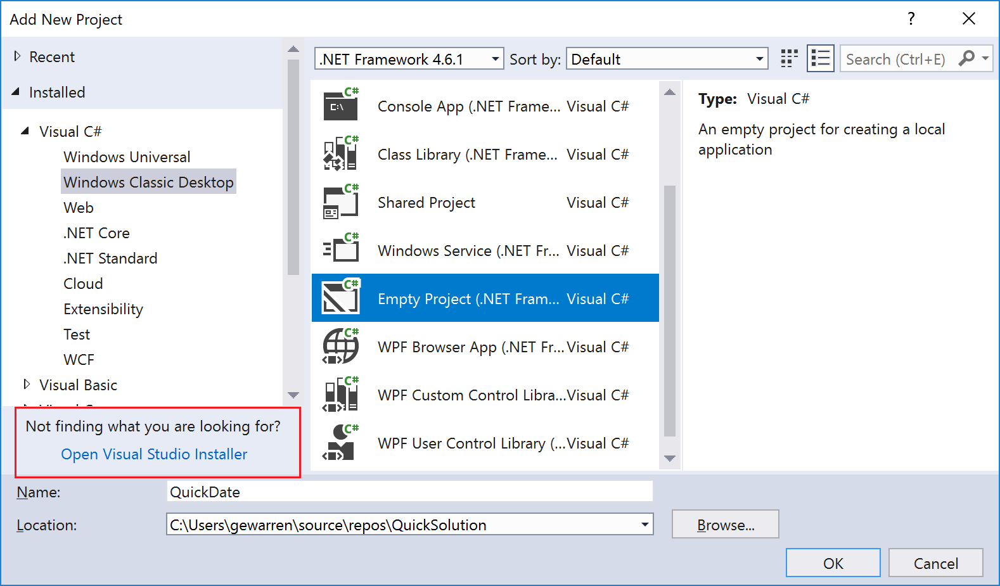
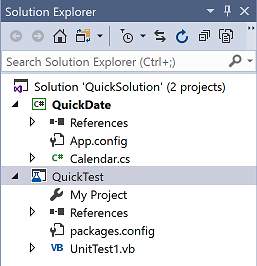
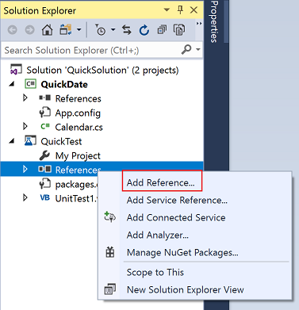
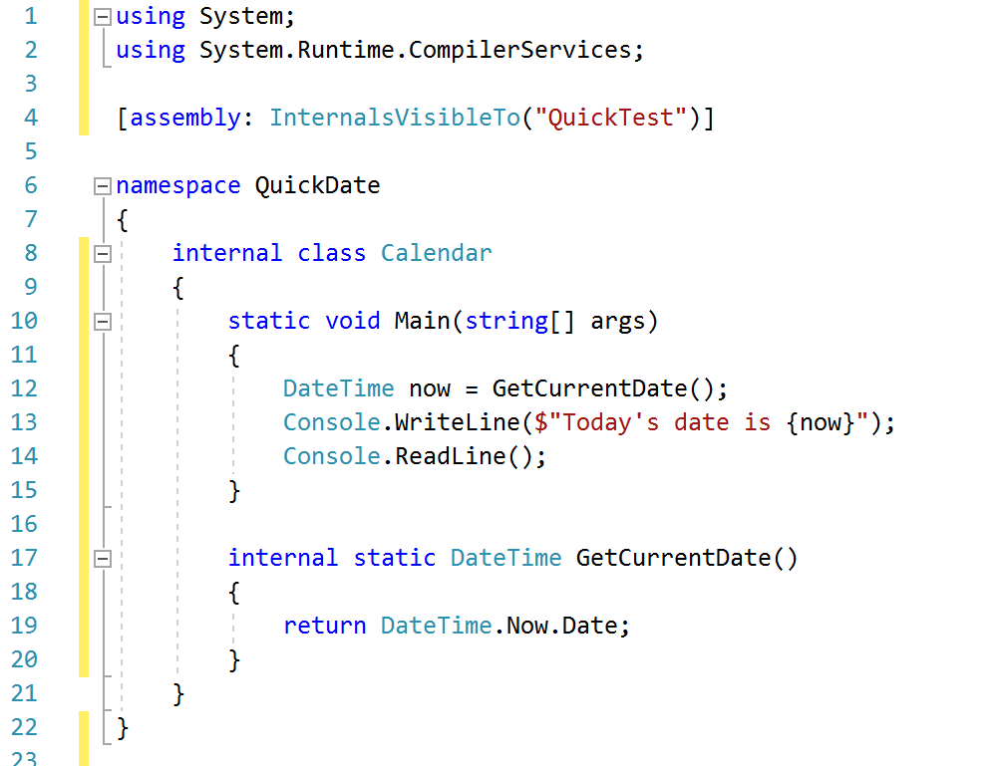
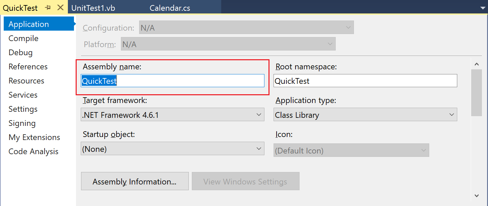

# Projects and solutions

In this 10-minute quickstart, we'll explore what it means to create a solution and a project in Visual Studio. We'll look at the properties of a project and some of the files it can contain. We'll also create a reference to a second project.

If you haven't already installed Visual Studio, go to the [Visual Studio downloads](https://aka.ms/vsdownload?utm_source=mscom&utm_campaign=msdocs) page to install it for free.

> [!TIP]
> We'll be constructing a solution and project from scratch in this quickstart, as an educational exercise to understand the concept of a project. In your general use of Visual Studio, you will most likely use the many project templates that Visual Studio offers when you are creating a new project.

> [!NOTE]
> Solutions and projects are not required to develop apps in Visual Studio. You can also just open a folder that contains code, and start coding, building, and debugging. For example, if you clone a GitHub repo, it might not contain Visual Studio projects and solutions. For more information, see [Develop code in Visual Studio without projects or solutions](../ide/develop-code-in-visual-studio-without-projects-or-solutions.md).

## Solutions

Solutions are containers used by Visual Studio to organize one or more related projects. When you open a solution in Visual Studio, it will automatically load all the projects it contains.

### Create a solution

We'll start our exploration by creating an empty solution. After you get to know Visual Studio, you probably won't find yourself creating empty solutions too often. When you create a new project in Visual Studio, it automatically creates a solution to house the project if there's not a solution already open.

1. Start Visual Studio.

   Visual Studio opens, and you'll likely see the **Start Page** taking up most of the window's real estate.

1. On the menu bar, choose **File** > **New** > **Project**.

   The **New Project** dialog box opens.

1. In the left pane, expand **Other Project Types**, then choose **Visual Studio Solutions**. In the center pane, choose **Blank Solution**. Name your solution "QuickSolution", then choose **OK**.

   

   The **Start Page** closes, and a solution appears in **Solution Explorer** on the right side of the Visual Studio window. You'll probably use **Solution Explorer** often, to browse the contents of your projects.

### Add a project

Now let's add our first project to the solution. We'll start with an empty project and add the items we need to the project.

1. From the right-click or context menu of **Solution 'QuickSolution'** in **Solution Explorer**, choose **Add** > **New Project**.

   The **Add New Project** dialog box opens.

1. In the left pane, expand **Visual C#** and choose **Windows Classic Desktop**. Then, in the middle pane, choose **Empty Project (.NET Framework)**. Name the project "QuickDate", then choose the **OK** button.

   A project named "QuickDate" appears beneath the solution in **Solution Explorer**. Currently it contains a single file called *App.config*.

   > [!NOTE]
   > If you don't see **Visual C#** in the left pane of the dialog box, you need to install the **.NET desktop development** workload. An easy way to do this is to choose the **Open Visual Studio Installer** link in the bottom left corner of the dialog box. After **Visual Studio Installer** launches, choose the **.NET desktop development** workload and then the **Modify** button.

   

## Add an item to the project

We have an empty project&mdash;let's add a code file.

1. From the right-click or context menu of **QuickDate** in **Solution Explorer**, choose **Add** > **New Item**.

   The **Add New Item** dialog box opens.

1. Expand **Visual C# Items**, then choose **Code**. In the middle pane choose **Class**. Name the class "Calendar", and then choose the **Add** button.

   A file named *Calendar.cs* is added to the project. The *.cs* on the end is the file extension that is given to C# code files. The file appears in the visual project hierarchy in **Solution Explorer**, and its contents are opened in the editor.

1. Replace the contents of the *Calendar.cs* file with the following code.

   ```csharp
   using System;

   namespace QuickDate
   {
       internal class Calendar
       {
           static void Main(string[] args)
           {
               DateTime now = GetCurrentDate();
               Console.WriteLine($"Today's date is {now}");
               Console.ReadLine();
           }

           internal static DateTime GetCurrentDate()
           {
               return DateTime.Now.Date;
           }
       }
   }
   ```

   You don't need to understand what the code does, but if you want, you can run the program and see that it prints today's date to the console window.

## Add a second project

It is common for solutions to contain more than one project, and often these projects reference each other. Some projects in a solution might be class libraries, some executable applications, and some might be unit test projects or web sites.

Let's add a unit test project to our solution. This time we'll start from a project template, so we don't have to add an additional code file to the project.

1. From the right-click or context menu of **Solution 'QuickSolution'** in **Solution Explorer**, choose **Add** > **New Project**.

   The **Add New Project** dialog box opens.

1. In the left pane, expand **Visual Basic** and choose the **Test** category. In the middle pane, choose **Unit Test Project (.NET Framework)**. Name the project "QuickTest", and then choose the **OK** button.

   A second project is added to **Solution Explorer**, and a file named *UnitTest1.vb* opens in the editor. *.vb* is the file extension that is given to Visual Basic code files.

   

## Add a project reference

We're going to use the new unit test project to test our method in the **QuickDate** project, so we need to add a reference to that project. This creates a build dependency between the two projects, meaning **QuickDate** will be built before **QuickTest** when the solution is built.

1. Choose the **References** node in the **QuickTest** project, and from the right-click or context menu, choose **Add Reference**.

   

   The **Reference Manager** dialog box opens.

1. In the left pane, expand **Projects** and choose **Solution**. In the middle pane, choose the checkbox next to **QuickDate**, and then choose the **OK** button.

   A reference to the **QuickDate** project is added.

## Add test code

1. Now we'll add test code to the Visual Basic code file. Replace the contents of *UnitTest1.vb* with the following code.

   ```vb
   <TestClass()> Public Class UnitTest1

       <TestMethod()> Public Sub TestGetCurrentDate()
           Assert.AreEqual(DateTime.Now.Date, QuickDate.Calendar.GetCurrentDate())
       End Sub

   End Class
   ```

   You'll see a red "squiggly" under some of the code. We'll fix this error by making the test project a [friend assembly](/dotnet/csharp/programming-guide/concepts/assemblies-gac/friend-assemblies) to the **QuickDate** project.

1. Back in the **QuickDate** project, open the *Calendar.cs* file if it's not already open, and add the following using statement and <xref:System.Runtime.CompilerServices.InternalsVisibleToAttribute> attribute, to resolve the error in the test project.

   ```csharp
   using System.Runtime.CompilerServices;

   [assembly: InternalsVisibleTo("QuickTest")]
   ```

   The code file should look like this.

   

## Project properties

The line in the C# code file that contains the <xref:System.Runtime.CompilerServices.InternalsVisibleToAttribute> attribute references the assembly name of the **QuickTest** project. The assembly name might not always be the same as the project name. To find the assembly name of a project, open the project properties.

1. In **Solution Explorer**, select the **QuickTest** project. From the right-click or context menu, select **Properties**, or just press **Alt**+**Enter**.

   The property pages for the project open on the **Application** tab. Notice that the assembly name of the **QuickTest** project is indeed "QuickTest". If you wanted to change it, this is where you would change it. Then, when you build the test project, the name of the resulting executable file would change from *QuickTest.exe* to whatever you chose.

   

1. Explore some of the other tabs of the project's property pages, such as **Compile** and **Settings**. These tabs will be different depending on the type of project.

## Next steps

If you want to check that your unit test is working, choose **Test** > **Run** > **All Tests** from the menu bar. A window called **Test Explorer** opens, and you should see that the **TestGetCurrentDate** test passes.

Congratulations on completing this Quickstart! Next, you might want to explore some of the other Quickstarts for Visual Studio, or learn more about how to [Create projects and solutions](../ide/creating-solutions-and-projects.md).

## See also

- [Quickstart: First look at the Visual Studio IDE](../ide/quickstart-ide-orientation.md)
- [Quickstart: Personalize the Visual Studio IDE and editor](../ide/quickstart-personalize-the-ide.md)
- [Quickstart: Coding in the editor](../ide/quickstart-editor.md)
- [Manage project and solution properties](../ide/managing-project-and-solution-properties.md)
- [Manage references in a project](../ide/managing-references-in-a-project.md)
- [Develop code in Visual Studio without projects or solutions](../ide/develop-code-in-visual-studio-without-projects-or-solutions.md)
- [Visual Studio IDE overview](../ide/visual-studio-ide.md)