# Visual Studio IDE overview

The Visual Studio interactive development environment (IDE) is a creative launching pad that you can use to view and edit nearly any kind of code, and then debug, build, and publish apps for Android, iOS, Windows, the web, and the cloud. There are versions available for Mac and Windows. This topic introduces you to the features of the Visual Studio IDE. We'll walk through some things you can do with Visual Studio and how to install and use it, create a simple project, get pointers on debugging and deploying code, and take a tour of the various tool windows.

## What can you do with the Visual Studio IDE?

Do you want to create an app for an Android phone? You can do that. How about create a cutting edge game using C++? You can do that too and much, much more. Visual Studio provides templates that help you make websites, games, desktop apps, mobile apps, apps for Office, and more.

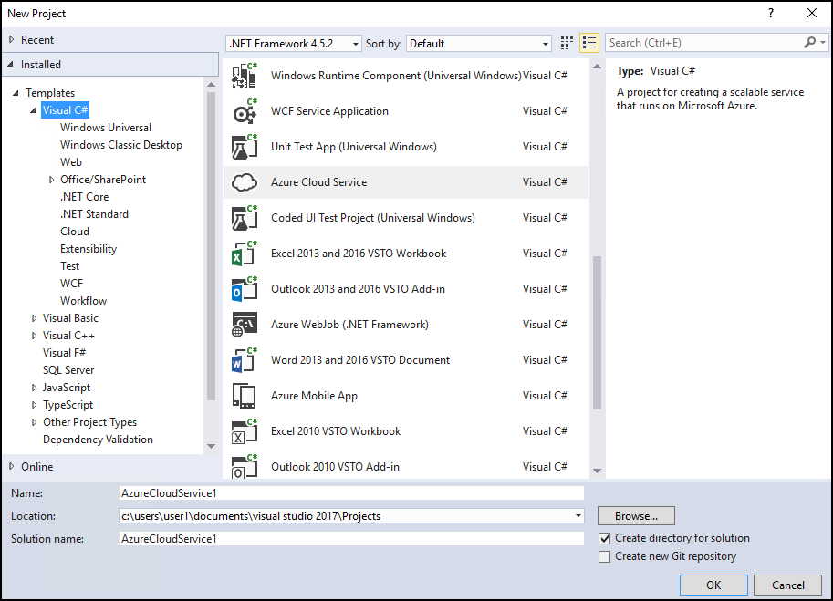

Or, you can simply open some code you get from almost anywhere and get working. See a project on GitHub that you like? Just clone the repository, open it in Visual Studio, and start coding!

## Quick tour of the IDE

To give you a high-level visual overview of Visual Studio, the following image shows Visual Studio with an open project along with several key tool windows you will most likely use:

- [Solution Explorer](../ide/solutions-and-projects-in-visual-studio.md) lets you view, navigate, and manage your code files. Solution Explorer can help organize your code by grouping the files into solutions and projects.

- The [Editor](../ide/writing-code-in-the-code-and-text-editor.md) window, where you'll likely spend a majority of your time, shows your code and enables you to edit source code and design a UI.

- The [Output](../ide/reference/output-window.md) window is where Visual Studio sends its notifications, such as debugging and error messages, compiler warnings, publishing status messages, and more. Each message source has its own tab.

- [Team Explorer (VSTS)](/vsts/user-guide/work-team-explorer) lets you track work items and share code with others using version control technologies such as [Git](https://git-scm.com/) and [Team Foundation Version Control (TFVC)](/vsts/tfvc/overview).

- [Cloud Explorer](/azure/vs-azure-tools-resources-managing-with-cloud-explorer) lets you view and manage your Azure resources, such as virtual machines, tables, SQL databases, and more. If a particular operation requires the Azure portal, Cloud Explorer provides links that take you to the place in the Azure portal you need to go.

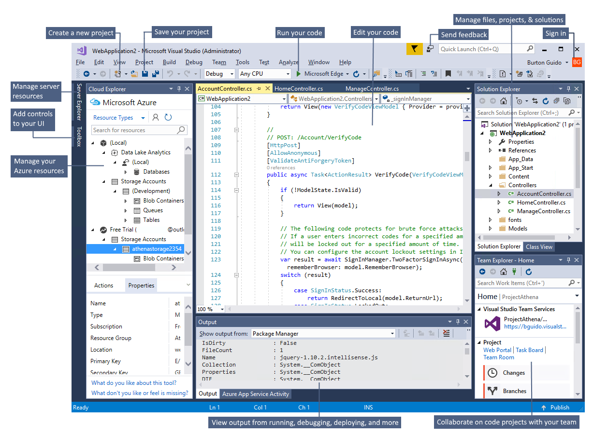

Following are some other common productivity features in Visual Studio:

- The [Quick Launch](../ide/reference/quick-launch-environment-options-dialog-box.md) search box is a great way to rapidly find what you need in Visual Studio. Just start entering in the name of whatever you are looking for, and Visual Studio lists results that take you exactly where you want to go. **Quick Launch** also shows links that start the Visual Studio Installer for any workload or individual component.

  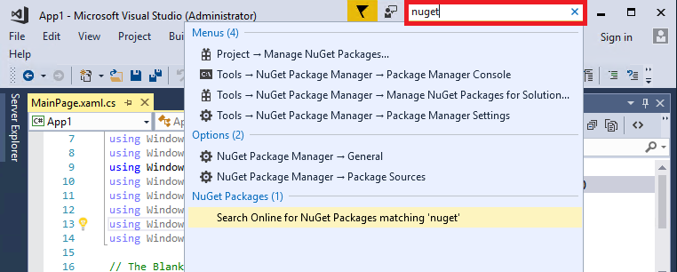

- [Refactoring](../ide/refactoring-in-visual-studio.md) includes operations such as intelligent renaming of variables, moving selected lines of code into a separate function, moving code to other locations, reordering function parameters, and more.

 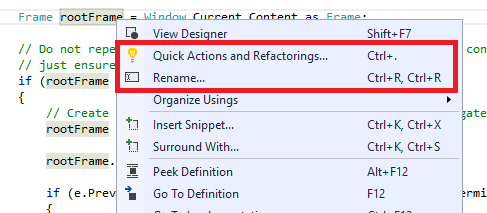

- **IntelliSense** is an umbrella term for a set of popular features that display type information about your code directly in the editor and, in some cases, write small bits of code for you. It's like having basic documentation inline in the editor, which saves you from having to look up type information in a separate help window. IntelliSense features vary by language. For more information, see [C# IntelliSense](../ide/visual-csharp-intellisense.md), [Visual C++ IntelliSense](../ide/visual-cpp-intellisense.md), [JavaScript IntelliSense](../ide/javascript-intellisense.md), and [Visual Basic IntelliSense](../ide/visual-basic-specific-intellisense.md). The following illustration shows some IntelliSense features at work:

  

- **Squiggles** are wavy red underlines that alert you to errors or potential problems in your code in real time as you type. This enables you to fix them immediately without waiting for the error to be discovered during compilation or run time. If you hover over the squiggle, you see additional information about the error. A light bulb may also appear in the left margin with suggestions for how to fix the error. For more information, see [Quick Actions](../ide/quick-actions.md).

 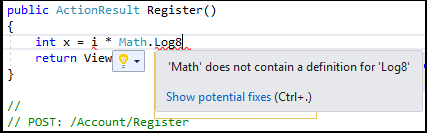

- The [Call Hierarchy](../ide/reference/call-hierarchy.md) window can be opened on the text editor context menu to show the methods that call, and are called by, the method under the caret (insertion point).

 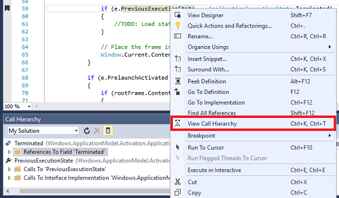

- [CodeLens](../ide/find-code-changes-and-other-history-with-codelens.md) enables you to find references and changes to your code, linked bugs, work items, code reviews, and unit tests, all without leaving the editor.

 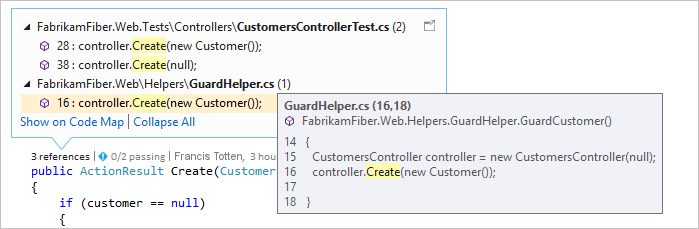

- The [Peek to Definition](../ide/how-to-view-and-edit-code-by-using-peek-definition-alt-plus-f12.md) window shows a method or type definition inline, without navigating away from your current context.

 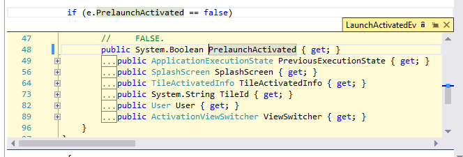

- The **Go To Definition** context menu option takes you directly to the place where the function or object is defined. Other navigation commands are also available by right-clicking in the editor.

 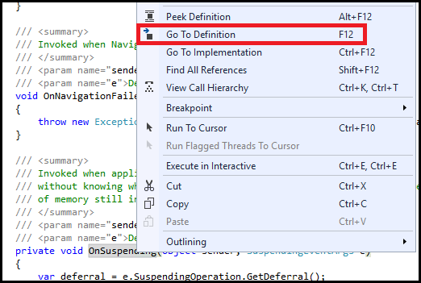

## Create a program

One good way to learn about something is to use it! Let's dive in and create a new, simple program.

1. Open Visual Studio. On the menu, choose **File** > **New** > **Project**.

  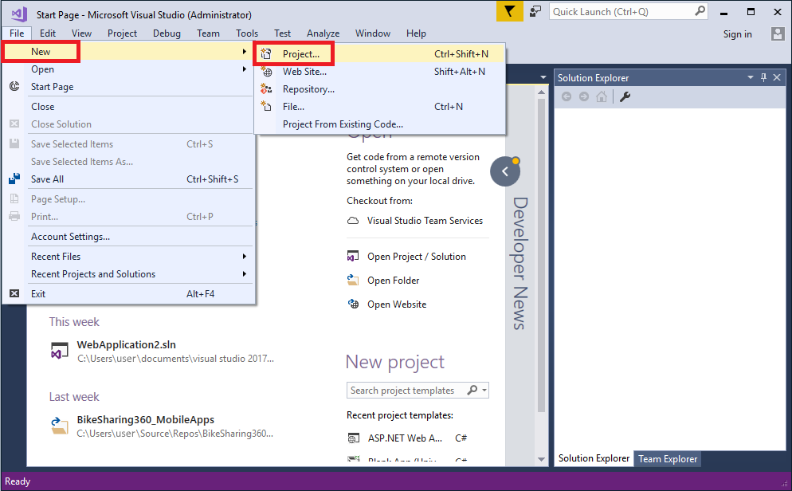

1. The **New Project** dialog box shows several project templates. Choose the **.NET Core** category under **Visual C#**, and then choose the **Console App (.NET Core)** template. In the **Name** text box, type "HelloWorld". Select the **OK** button.

  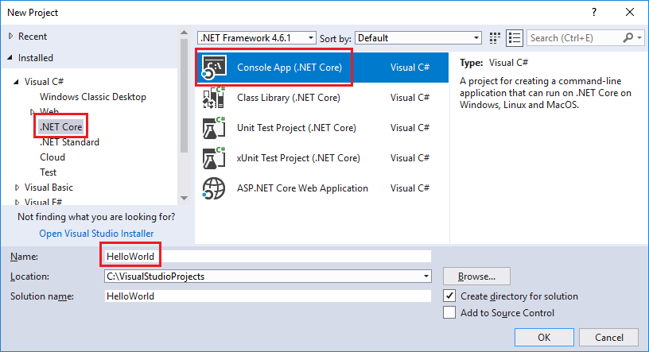

  > [!NOTE]
  > If you don't see the **.NET Core** category, you need to install the **.NET Core cross-platform development** workload. To do this, choose the **Open Visual Studio Installer** link on the bottom left of the **New Project** dialog. After **Visual Studio Installer** opens, scroll down and select the **.NET Core cross-platform development** workload, and then choose **Modify**.

   Visual Studio uses the template to create your project. It is a simple "Hello World" application that calls the <xref:System.Console.WriteLine> method to display the literal string "Hello World!" in the console window.

1. Shortly, you should see something like the following screenshot:

  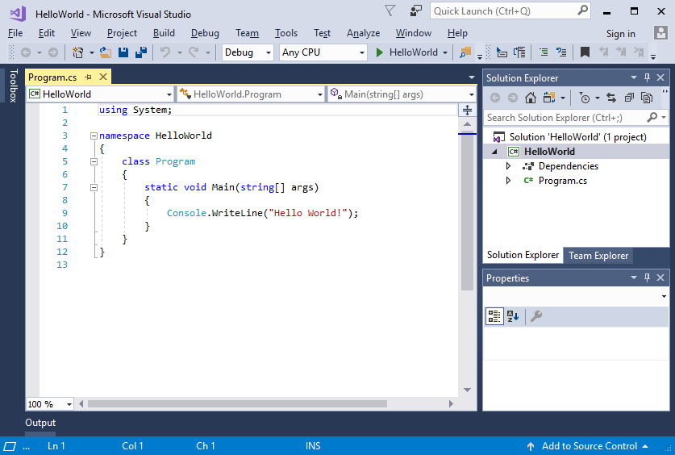

   The C# code for your application is shown in the editor window, which takes up most of the space. Notice that the code syntax is automatically colorized to indicate different types of code, such as keywords and types. In addition, small, vertical dashed lines in the code indicate which braces match one another, and line numbers help you locate code later. You can choose the small, boxed minus signs to collapse or expand code. This code outlining feature lets you hide code you don't need, helping to minimize onscreen clutter.

   The project files are listed on the right side in a window called **Solution Explorer**.

  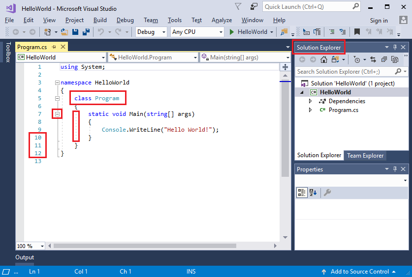

  There are other menus and tool windows available, but let's move on for now.

1. Now, start the app. You can do this by choosing **Start Without Debugging** from the **Debug** menu on the menu bar. You can also press **Ctrl**+**F5**.

  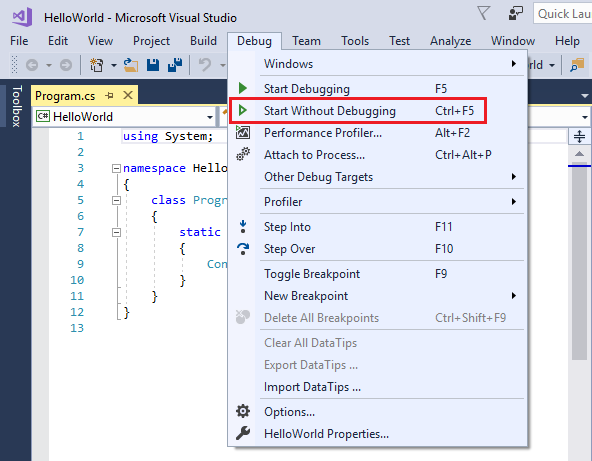

  Visual Studio builds the app, and a console window opens with the message "Hello World!". You now have a running app!

  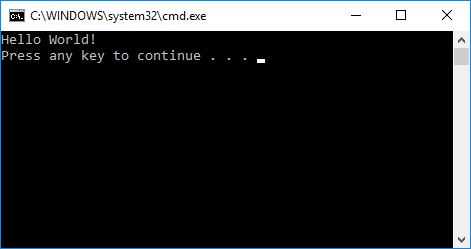

1. To close the console window, press any key on your keyboard.

1. Let's add some additional code to the app. Add the following C# code before the line that says `Console.WriteLine("Hello World!");`:

   ```csharp
   Console.WriteLine("\nWhat is your name?");
   var name = Console.ReadLine();
   ```

   This code displays "What is your name?" in the console window, and waits until the user enters some text followed by the **Enter** key.

1. Now change the line that says `Console.WriteLine("Hello World!");` to the following code:

   ```csharp
   Console.WriteLine($"\nHello {name}!");
   ```

1. Run the app again by selecting **Debug** > **Start Without Debugging** or by pressing **Ctrl**+**F5**.

   Visual Studio rebuilds the app, and a console window opens and prompts you for your name.

1. Enter your name in the console window and press **Enter**.

   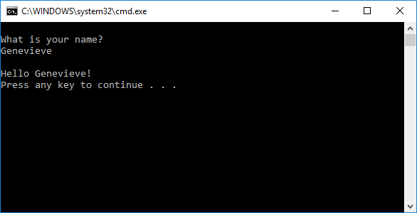

1. Press any key to close the console window.

## Debug, test, and improve your code

Nothing runs perfectly all the time. When you write code, you need to run it and test it for bugs and performance. Visual Studio's cutting edge debugging system enables you to debug code running in your local project, on a remote device, or on an emulator such as [the one for Android devices](../cross-platform/visual-studio-emulator-for-android.md). You can step through code one statement at a time and inspect variables as you go. You can set breakpoints that are only hit when a specified condition is true. You can monitor the values of variables as the code runs, and more. All of this can be managed in the code editor itself, so that you don't have to leave your code. To get more details about debugging in Visual Studio, see [Debugger feature tour](../debugger/debugger-feature-tour.md).

For testing, Visual Studio offers unit testing, IntelliTest, load and performance testing, and more. To learn more about testing, see [Testing tools and scenarios](../test/developer-testing-scenarios.md). To learn more about improving the performance of your apps, see [Profiling feature tour](../profiling/profiling-feature-tour.md).

## Deploy your finished application

When your application is ready to deploy to users or customers, Visual Studio provides the tools to do that, whether you're deploying to Microsoft Store, to a SharePoint site, or with InstallShield or Windows Installer technologies. It's all accessible through the IDE. For more information, see [Deploy applications, services, and components](../deployment/deploying-applications-services-and-components.md).

## Extend Visual Studio

If Visual Studio doesn't have the exact functionality you need, you can add it! You can personalize the IDE based on your workflow and style, add support for external tools not yet integrated with Visual Studio, and modify existing functionality to increase your productivity. To find the latest version of the Visual Studio Extensibility Tools (VS SDK), see [Visual Studio SDK](../extensibility/visual-studio-sdk.md).

You can use the .NET Compiler Platform ("Roslyn") to write your own code analyzers and code generators. Find everything you need at [Roslyn](https://github.com/dotnet/Roslyn).

Find [existing extensions](https://marketplace.visualstudio.com/vs) for Visual Studio created by Microsoft developers as well as our development community.

To learn more about extending Visual Studio, see [Extend Visual Studio IDE](https://www.visualstudio.com/vs/extend/).

## Learn more and find out what's new

If you've never used Visual Studio before, look at [Get started developing with Visual Studio](../ide/get-started-developing-with-visual-studio.md), or check out the free Visual Studio courses available on [Microsoft Virtual Academy](https://mva.microsoft.com/product-training/visual-studio-courses#!index=2&lang=1033). If you want to check out the new features in Visual Studio 2017, see [What's new in Visual Studio 2017](../ide/whats-new-in-visual-studio.md).

Congratulations on completing the tour of the Visual Studio IDE! We hope you learned something useful about some of its main features.

## See also

* [Visual Studio IDE](https://www.visualstudio.com/vs/)
* [Visual Studio downloads](https://www.visualstudio.com/downloads/)
* [The Visual Studio blog](https://blogs.msdn.microsoft.com/visualstudio/)
* [Visual Studio forums](https://social.msdn.microsoft.com/Forums/vstudio/home?category=visualstudio%2Cvsarch%2Cvsdbg%2Cvstest%2Cvstfs%2Cvsdata%2Cvsappdev%2Cvisualbasic%2Cvisualcsharp%2Cvisualc)
* [Microsoft Virtual Academy](https://mva.microsoft.com/)